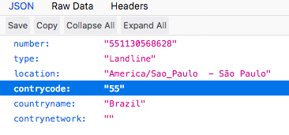

# Phone-number
[](https://bettercodehub.com/)
This simple api using web scraping was created to get information about certain phone numbers.

It was written to get info from phone numbers, by not using a browser behind, it becomes much faster and consume fewer resources using cheerio <3.

OBS: for depending on an external service, this may break, but I hope this is useful for you to validate your idea.

Contributions are accepted, thanks!

## Prerequisites
node, npm

### Installing
```
git clone https://github.com/LuizFelipeNeves/phone-number/.git
cd phone-number
npm install

```

### Usage
Ex: https://localhost:5000/551130568628
  



### Acknowledgments
Thanks @micalevisk for help with doubts and improvements. 
